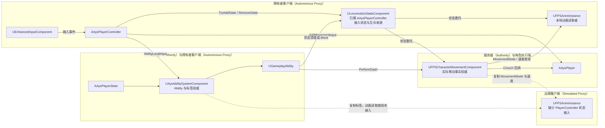
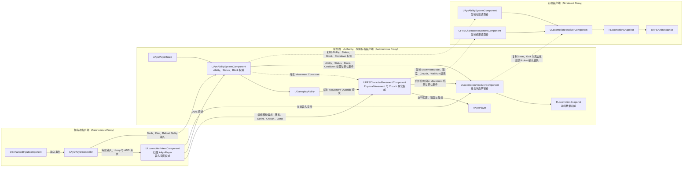

# Ays 角色运动状态架构设计 v1.0

状态：实施中<br>
版本：v1.0<br>
更新时间：2026-08-26

## 1. 背景

当前项目的角色运动功能分布在四处：`AAysPlayerController` 接收输入并直接修改 `ULocomotionStateComponent`，`UFPSCharacterMovementComponent` 执行真实移动，`AAysPlayerState` 上的 `UAysAbilitySystemComponent` 管理 Gameplay Ability，`UFPSAnimInstance` 通过状态委托以及 CMC 查询推导动画变量。

这种调用关系使同一事实拥有多个来源：Sprint 同时出现在状态标签、CMC 的 `Safe_bWantsToSprint` 以及速度计算中；Crouch 请求和胶囊体结果也分别存在于状态组件以及 CMC。`AAysPlayerController` 只存在于服务器与拥有者客户端，远端动画读取该对象时缺少稳定的数据来源。

本设计将运行时职责划分为四个边界：

1. **输入意图**：记录玩家希望持续执行的动作以及一次性动作请求。
2. **角色状态解析**：组合输入意图、CMC 结果以及 ASC 约束，生成一个确定的状态快照。
3. **CMC 与 ASC 执行**：CMC 处理碰撞和运动，ASC 处理能力、限制、冷却以及状态效果。
4. **动画快照**：向动画系统发布最终结果，动画系统只读取并插值。

### 1.1 当前架构图



当前调用关系中，`AAysPlayerController` 上的状态组件同时承担输入状态、互斥处理以及动画通知。CMC 和 ASC 的结果通过不同路径进入动画实例，远端角色缺少 `AAysPlayerController` 上的状态组件提供的数据。

### 1.2 目标架构图



目标架构中，`ULocomotionIntentComponent`、`ULocomotionResolverComponent` 以及 `FLocomotionSnapshot` 归属于 `AAysPlayer`。拥有者客户端从 `AAysPlayerController` 写入 Intent；Intent 向 CMC 提交常规移动请求，并向 ASC 提交 ADS 请求；`AAysPlayerController` 将 Dash、Fire、Reload 的 Ability 输入提交给 ASC。Gameplay Ability 经 ASC 授权后向 CMC 提交临时 Movement Override 请求。CMC 合并两类请求并发布唯一的实际 Movement 结果，ASC 发布 Ability 与标签结果，Resolver 生成完整 Snapshot，本地与远端 `UFPSAnimInstance` 使用相同的 Snapshot 读取接口。

## 2. 设计目标

- 每个运行时事实拥有唯一权威来源。
- 输入请求与动作结果保持清晰区分。
- 角色状态可以在远端客户端从复制数据重建。
- Slide、WallRun 等复杂运动继续使用自定义 CMC 模式。
- ADS、Dash、Stun、Cooldown、Block 由 ASC 以及 Gameplay Ability 管理。
- 新增状态层时，只需扩展对应层的解析规则以及快照字段。
- 保留现有运动参数、动画资产以及第一人称相机行为，状态重构阶段只调整数据流向。

## 3. 设计范围

本设计覆盖 Grounded、Airborne、Slide、WallRun、Standing、Crouched、Idle、Walk、Run、Sprint、Hip、ADS、Lean、Jump、Dash、Fire、Reload 以及 Dead、Stunned、Rooted、Block 等状态。

体力、载具、游泳、梯子、Zipline、全新的动画资产以及运动参数调优保留给后续需求。它们需要通过本设计定义的 Intent、Resolver、CMC、ASC 或 Snapshot 接口接入。

## 4. 基本原则

本文将 `UFPSCharacterMovementComponent` 简称为 CMC，将 `UAysAbilitySystemComponent` 简称为 ASC。简称只用于正文，图示保留完整类名。

### 4.1 输入意图持续存在

输入组件负责记录按键或摇杆产生的意图。意图描述玩家希望执行的动作，Resolver 使用实际移动结果以及能力限制判断动作是否成立。

持续输入包括移动方向、Sprint、Crouch、Lean 左右以及 ADS 请求。Jump、Dash、Fire、Reload 使用递增序号表达一次性请求，避免事件在动画更新间隔中丢失。

### 4.2 事实权威与请求来源

- PhysicalMovement、速度、加速度、Crouch 胶囊体结果以及 WallRun 侧别由 CMC 提供。
- Aim、Ability、Status、Block、Cooldown 由 ASC 以及 Gameplay Effect 提供。
- Gait、Lean 以及动画需要的组合结果由 Resolver 提供。
- 动画变量来自 Snapshot，动画逻辑不写入状态，也不激活 Ability。

请求来源可以有多个，执行结果需要集中到对应的执行模块。CMC 接收 Intent 的常规移动请求以及 ASC 授权后的临时 Movement Override 请求，并在内部合并后发布一个实际移动结果；ASC 仍然负责 Ability 是否能够激活以及限制条件。CMC 的两个入口属于请求入口，PhysicalMovement、速度、碰撞以及 Crouch 结果仍然只有 CMC 一个事实来源。

### 4.3 状态层可以组合

PhysicalMovement、Stance、Gait、Aim、Lean、Action、Status/Block 属于独立层。不同层可以同时成立，同一层只保留一个值。`Normal`仅作为组合描述，表示 `Grounded + Standing + Hip + None + Idle/Walk/Run`。

### 4.4 解析过程保持确定性

Resolver 按照固定顺序读取数据，并在一次更新中生成完整 Snapshot。规则使用优先级以及约束条件表达，状态对象之间不直接调用 `RemoveState`。

## 5. 模块职责

### 5.1 `AAysPlayerController`

负责：

- 绑定 Enhanced Input。
- 将移动、Sprint、Crouch、Lean、Jump 以及 ADS 输入写入角色上的 `ULocomotionIntentComponent`。
- 将 Dash、Fire、Reload 的 Ability 输入提交给角色 ASC。
- 处理视角、相机以及本地武器输入。

角色运动状态、互斥结果以及 CMC 事实均由角色侧组件提供。远端角色的动画和 CMC 不读取 PlayerController。

### 5.2 `ULocomotionIntentComponent`

该组件挂在 `AAysPlayer` 上，保存 `FLocomotionIntent`。它只保存输入意图以及一次性请求序号，不读取碰撞、不修改速度，也不确认 Crouch、Slide 或 WallRun 是否成功。

Intent 属于拥有者本地输入数据。持续移动输入通过 CMC 的 SavedMove 进入服务器；Ability 请求通过 GAS 的预测与复制机制进入服务器。完整 Intent 不逐帧复制给远端观察者。

### 5.3 `ULocomotionResolverComponent`

该组件挂在 `AAysPlayer` 上，读取以下数据：

- `ULocomotionIntentComponent` 的当前 Intent。
- CMC 的 MovementMode、CustomMovementMode、速度、加速度、Crouch 结果以及 WallRun 侧别。
- ASC 的 Ability、State、Status、Block、Cooldown 标签。

Resolver 只生成 `FLocomotionSnapshot`，不调用 `SetMovementMode`、不修改速度、不调用 `Crouch`，也不移除其它状态。

### 5.4 `UFPSCharacterMovementComponent`

负责：

- Walking、Falling、Crouch 以及跳跃。
- `CMOVE_Slide` 与 `CMOVE_WallRun` 的进入、物理过程以及退出。
- 速度、加速度、碰撞、地面检测以及网络预测。
- 将实际 MovementMode、Crouch 回调以及 WallRun 侧别发布给角色侧解析组件。

CMC 不读取 ADS 的视觉状态、武器 Ability 逻辑或动画变量。CMC 可以读取 ASC 发布的只读 Movement Constraint，例如 `Block.Sprint` 或 `MaxGait=Walk`，并将限制应用于速度和移动请求；实际位置、速度以及 MovementMode 仍由 CMC 发布。Sprint 只作为预测输入和速度条件参与 CMC 计算，最终 Gait 由 Resolver 发布。

CMC 的请求入口分为两个部分：

- **常规移动请求**：来自 Intent，包含移动方向、Sprint、Crouch 以及 Jump 请求，持续参与普通移动模拟；Jump 使用请求序号标记一次性请求。
- **Movement Override 请求**：来自 ASC，包含 Dash 等 Ability 的临时运动参数，生效期间拥有更高执行优先级。

CMC 同时只接受一个有效的 Movement Override。Override 生效期间，CMC 使用 Override 提供的方向、速度、持续时间以及碰撞规则，忽略 Intent 中会改变速度和方向的常规字段；Intent 继续保存当前按键状态，供 Override 结束后恢复普通移动。新的 Override 需要在旧 Ability 结束后提交，避免多个 Ability 同时写入 CMC。

CMC 每次更新先检查有效的 Movement Override，再执行常规移动请求。Override 失效后立即恢复当前 Intent。两类请求都不直接发布动画状态，CMC 只发布合并后的 MovementMode、速度、加速度、Crouch 以及 WallRun 结果，并为已执行的 Jump 与 Movement Override 发布带请求序号的确认事件。

### 5.5 ASC 与 Gameplay Ability

ASC 位于 `AAysPlayerState`，负责：

- `GA_ADS`、Dash 以及武器 Ability 的激活、预测、复制、结束与冷却。
- `State.Aim.ADS`、Status 以及 Block 标签的授予和移除。
- Fire、Reload 对运动、Sprint、ADS 的限制。

ASC 授权 Gameplay Ability 后，由 Ability 向 CMC 提交一次性 Movement Override 请求。ASC 维护 Ability 的激活与结束，CMC 维护 Override 的运动执行。Ability 不直接修改 `ULocomotionIntentComponent`，也不保存 CMC 的物理状态。

### 5.6 `FLocomotionSnapshot`

Snapshot 由 Resolver 持有，并在角色侧提供只读访问。它包含动画所需的最终层状态、运动数据以及一次性动作事件。Snapshot 可以在本地角色和远端角色上由相同规则生成。

### 5.7 `UFPSAnimInstance`

动画实例每次更新读取 Snapshot，并对 Lean、Crouch、速度方向以及其它视觉参数进行插值。动画实例不绑定 PlayerController 上的状态委托，不调用状态写入函数，也不激活 Ability。

## 6. 状态模型

### 6.1 PhysicalMovement

值域为 `Grounded`、`Airborne`、`Slide`、`WallRun`，权威来源为 CMC：

- `MOVE_Walking` 与 `MOVE_NavWalking` 映射为 `Grounded`。
- `MOVE_Falling` 映射为 `Airborne`。
- `MOVE_Custom + CMOVE_Slide` 映射为 `Slide`。
- `MOVE_Custom + CMOVE_WallRun` 映射为 `WallRun`。

### 6.2 Stance

值域为 `Standing`、`Crouched`，依据 CMC 的实际胶囊体状态生成。输入只产生 Crouch 请求；`OnStartCrouch` 与 `OnEndCrouch` 回调确认结果。Crouch 请求受阻时保持原有 Stance，直到 CMC 发布成功回调。

### 6.3 Gait

值域为 `Idle`、`Walk`、`Run`、`Sprint`，权威来源为 Resolver。Resolver 使用水平速度、移动输入、移动方向、PhysicalMovement、Stance、Aim、Status 以及 Block 计算 Gait。

Sprint 必须同时满足以下条件：角色处于 `Grounded`、Stance 为 `Standing`、ADS 未生效、没有 `Block.Sprint` 或 `Block.Movement`，水平速度与移动方向达到配置阈值。阈值需要设置进入值、退出值以及迟滞，防止速度临界点反复切换。

Sprint 的进入判定使用移动输入强度、移动方向以及可达速度，持续判定使用实际水平速度。Lean 处于 `Left` 或 `Right` 时，Gait 按实际水平速度在 `Walk` 与 `Run` 之间选择，Sprint 请求继续保存在 Intent 中。

### 6.4 Aim

值域为 `Hip`、`ADS`，权威来源为 ASC 的 `GA_ADS` 以及 `State.Aim.ADS`。按下 Aim 后，`AAysPlayerController` 更新 Intent 的 `bADSRequested`；ASC 根据该请求激活或结束 `GA_ADS`。再次按下 Aim 后清除请求。Ability 激活成功后才发布 ADS；能力被 Block、武器切换或角色状态终止时，Resolver 发布 Hip。

### 6.5 Lean

值域为 `None`、`Left`、`Right`，权威来源为 Resolver。左右输入同时存在时使用 Intent 记录的最近一次有效输入方向。`Slide` 默认输出 `None`；`WallRun` 根据 CMC 的墙面侧别覆盖手动 Lean 目标。

### 6.6 Action

Jump、Dash、Fire、Reload 以带序号的短时事件发布。输入请求序号用于关联和去重，Action 事件需要在 CMC 或 ASC 确认执行后产生。事件包含类型、序号以及发生时间，动画可以消费事件并记录最后消费序号。Dash 事件需要同时匹配 ASC 的 Ability 激活确认和 CMC 的 Movement Override 接受确认，Resolver 只发布一次该 Dash Action，不表示一个持续 Locomotion 层。

### 6.7 Status 与 Block

Dead、Stunned、Rooted 以及 `Block.*` 由 ASC 标签表达。`Block.Movement` 阻止移动相关请求，`Block.Sprint` 限制 Sprint，`Block.ADS` 限制 ADS。Block 标签由 Gameplay Effect 管理，多个来源同时持有同一标签时保留到所有来源结束。

## 7. `FLocomotionIntent` 数据契约

```cpp
UENUM(BlueprintType)
enum class ELocomotionLeanDirection : uint8
{
    None,
    Left,
    Right
};
```

```cpp
USTRUCT(BlueprintType)
struct FLocomotionIntent
{
    GENERATED_BODY()

    UPROPERTY(BlueprintReadOnly)
    FVector2D MoveInput = FVector2D::ZeroVector;

    UPROPERTY(BlueprintReadOnly)
    bool bSprintHeld = false;

    UPROPERTY(BlueprintReadOnly)
    bool bCrouchHeld = false;

    UPROPERTY(BlueprintReadOnly)
    bool bLeanLeftHeld = false;

    UPROPERTY(BlueprintReadOnly)
    bool bLeanRightHeld = false;

    UPROPERTY(BlueprintReadOnly)
    ELocomotionLeanDirection LastLeanInput = ELocomotionLeanDirection::None;

    UPROPERTY(BlueprintReadOnly)
    bool bADSRequested = false;

    UPROPERTY(BlueprintReadOnly)
    uint32 JumpRequestId = 0;

    UPROPERTY(BlueprintReadOnly)
    uint32 DashRequestId = 0;

    UPROPERTY(BlueprintReadOnly)
    uint32 FireRequestId = 0;

    UPROPERTY(BlueprintReadOnly)
    uint32 ReloadRequestId = 0;
};
```

`JumpRequestId`、`DashRequestId`、`FireRequestId` 以及 `ReloadRequestId` 每次收到对应输入时递增。Resolver 使用这些序号关联 CMC 或 ASC 的确认事件，并为每个已确认请求发布一次 Action 事件。

Jump 请求通过 Intent 的常规移动通道提交给 CMC，Dash、Fire、Reload 的 Ability 输入提交给 ASC，ADS 请求通过 Intent 提交给 ASC。请求序号用于输入记录、去重以及确认事件关联，执行模块不会根据序号直接发布成功状态。

CMC 与 ASC 需要发布带有请求序号的确认事件：CMC 确认 Jump 以及 Movement Override，ASC 确认 Dash、Fire、Reload 以及 ADS Ability。Resolver 使用确认事件生成 Snapshot Action；Dash 需要先后匹配两个模块的相同 `DashRequestId`；远端角色使用复制的确认事件序号重建相同的 Action。

## 8. `FLocomotionSnapshot` 数据契约

Snapshot 至少包含以下字段：

- `PhysicalMovement`、`Stance`、`Gait`、`Aim`、`Lean`。
- `Speed2D`、移动方向、加速度大小、`bIsFalling`。
- `bWallRunIsRight`、`CrouchAlpha`。
- 当前 Action 类型、Action 序号以及有效标记。
- Snapshot 修订序号，用于调试和动画事件消费。

Snapshot 的每个字段都需要注明来源。CMC 字段更新后，Resolver 在同一次角色更新中重新计算组合结果。动画实例读取上一份完整 Snapshot，避免读取到不同更新时刻的字段组合。

字段来源固定如下：

- `PhysicalMovement`、`Stance`、`Speed2D`、移动方向、加速度大小、`bIsFalling`、`bWallRunIsRight` 以及 `CrouchAlpha` 读取 CMC 的实际结果。
- `Aim` 读取 ASC 的 `State.Aim.ADS`，由 Resolver 写入 Snapshot。
- `Gait` 与 `Lean` 由 Resolver 根据 Intent、CMC 结果以及 ASC 约束计算。
- Action 类型、Action 序号以及有效标记读取 CMC 或 ASC 的确认事件，由 Resolver 负责去重和发布。
- Snapshot 修订序号由 Resolver 递增。

拥有者客户端和服务器可以直接读取当前 Intent。服务器接收 SavedMove 或 ASC 请求后，需要把已接受的移动输入和请求序号同步到服务器侧 Intent，供服务器 Resolver 使用。远端客户端没有拥有者输入时，服务器 Resolver 计算出的 Lean、Gait 以及无法由 CMC 或 ASC 重建的 Action 确认结果，通过轻量复制字段提供给远端 Resolver。

## 9. 状态解析顺序

Resolver 按照以下顺序生成 Snapshot：

1. 读取 ASC 的 Dead、Stunned、Rooted 以及 Block 标签。
2. 读取 CMC 的 MovementMode、CustomMovementMode、Crouch 结果以及 WallRun 侧别。
3. 生成 PhysicalMovement 与 Stance。
4. 读取 `State.Aim.ADS`，生成 Aim。
5. 依据输入、速度、方向、PhysicalMovement、Stance、Aim 以及 Block 生成 Gait。
6. 依据 Lean 输入生成 Lean；WallRun 侧别拥有覆盖手动 Lean 的优先级。
7. 读取 CMC 或 ASC 已确认的动作事件，生成 Jump、Dash、Fire、Reload Action 事件。
8. 发布完整 Snapshot，并更新 Snapshot 修订序号。

解析过程只产生数据。所有位置、速度、碰撞以及 Ability 生命周期变化由 CMC 或 ASC 执行。

## 10. 关键行为规则

### 10.1 Crouch、Slide

- Crouch 输入只设置 `bCrouchHeld`，Intent 通过常规移动通道向 CMC 提交请求。
- CMC 成功进入 Crouch 后触发 `OnStartCrouch`，Resolver 依据该实际结果发布 `Stance.Crouched`。
- CMC 解除蹲伏受阻时继续保持 `Stance.Crouched`。
- 角色在高速 Grounded 状态按下 Crouch 时，CMC 根据滑铲条件进入 `CMOVE_Slide`。
- Slide 的进入与退出完全由 CMC 决定，Resolver 依据 MovementMode 发布 PhysicalMovement。

### 10.2 Sprint

- `bSprintHeld` 表示输入持续状态。
- Resolver 依据输入强度、速度、方向、Stance、Aim、Lean、Status 以及 Block 判断 `Gait.Sprint`。
- Sprint 意图在 ADS、Crouch、Lean 或 Block 条件下保持，条件解除后由 Resolver 重新计算。
- CMC 的 SavedMove 保存服务器需要的 Sprint 输入，服务器根据自身规则重新确认速度。
- CMC 的 Movement Override 生效期间，普通 Sprint 请求继续保存在 Intent 中，Override 结束后恢复计算。

### 10.3 WallRun

- CMC 负责墙面检测、重力、墙面吸附、跳离以及退出。
- `CMOVE_WallRun` 映射为 `PhysicalMovement.WallRun`。
- 墙面左右侧别属于 CMC 运动结果，需要进入 SavedMove 或可靠复制字段。
- WallRun 默认阻止 ADS，允许 Lean 输出，但墙面侧别覆盖手动 Lean 方向。

### 10.4 ADS

- `GA_ADS` 是持续型 Ability，激活成功后授予 `State.Aim.ADS`。
- `bADSRequested` 保持期间维持 Ability；ASC 读取 Intent 的请求并维持 `GA_ADS`。请求清除、Ability 被 Block 或能力结束时移除标签。
- ADS 对速度、FOV、武器姿态的修改由 Ability 或 Gameplay Effect 管理。
- Resolver 只读取 ASC 标签，动画只读取 Snapshot Aim。

### 10.5 Dash

- Dash 输入递增 `DashRequestId`，并向 ASC 提交 Ability 输入。
- Ability 负责冷却、Block、激活预测以及结束；激活成功后向 CMC 提交预测 Movement Override。
- CMC 负责方向、强度、持续时间、碰撞以及服务器校正。
- CMC 接受 Movement Override 后，Resolver 发布一次 Dash Action 事件。
- Dash 不写入持久 Locomotion 层。

### 10.6 武器 Ability 的运动限制

Fire、Reload 等 Ability 通过 Gameplay Effect 添加 `Block.*` 标签。标签的生命周期跟随 Ability 或动画段落，Ability 结束时由 ASC 自动移除。Resolver 读取 Block 结果，计算 Gait、Aim 以及其它可用层。

### 10.7 输入到结果的路径

以 Crouch 为例，完整路径如下：

1. `UEnhancedInputComponent` 触发 `AAysPlayerController::CrouchStart` 或 `CrouchEnd`。
2. `AAysPlayerController` 更新 `ULocomotionIntentComponent::FLocomotionIntent::bCrouchHeld`。
3. Intent 将当前 Crouch 请求放入 CMC 的常规移动请求。
4. `UFPSCharacterMovementComponent` 根据碰撞和运动规则执行 Crouch 或 Slide。
5. CMC 触发 `AAysPlayer::OnStartCrouch` 或 `OnEndCrouch`，并发布实际胶囊体结果。
6. `ULocomotionResolverComponent` 读取 CMC 结果，生成 `Stance`、`PhysicalMovement` 以及 `Gait`。
7. `FLocomotionSnapshot` 提供只读数据给 `UFPSAnimInstance`。

Dash 采用另一条请求通道：`AAysPlayerController` 将 Ability 输入提交给 `UAysAbilitySystemComponent`，`UGameplayAbility_Dash` 通过 ASC 授权后向 CMC 提交 Movement Override。CMC 接受并执行 Override 后发布确认事件，Resolver 根据确认事件生成一次 Dash Action；Override 结束后，CMC 恢复读取 Intent 的常规移动请求。

## 11. Gameplay Tags

新逻辑使用以下层级：

```text
Input.Sprint                 Input.Crouch
Input.Lean.Left              Input.Lean.Right
Input.Weapon.ADS

Ability.Aim.ADS              Ability.Movement.Dash

State.Movement.Grounded      State.Movement.Airborne
State.Movement.Slide         State.Movement.WallRun
State.Stance.Standing        State.Stance.Crouched
State.Gait.Idle              State.Gait.Walk
State.Gait.Run               State.Gait.Sprint
State.Aim.ADS
State.Lean.Left              State.Lean.Right

Action.Jump                  Action.Dash
Action.Fire                  Action.Reload

Status.Dead                  Status.Stunned
Status.Rooted                Block.Movement
Block.Sprint                 Block.ADS
Cooldown.Dash
```

CMC 只发布 MovementMode 变化，角色侧同步逻辑根据这些结果更新 `State.Movement.*` 镜像标签；ASC 在 Ability、Status、Block 变化时管理对应标签。镜像标签用于 Ability 查询，CMC 仍然保留 MovementMode 的执行权威。Aim 的默认值为 Hip，Lean 的默认值为 None，默认值使用 Snapshot 层值表达。Resolver 以组件和 ASC 的结果为输入，旧的平铺 `State.Locomotion.*` 标签只在迁移期间保留兼容读取。

## 12. 网络规则

### 12.1 Autonomous Proxy

- 本地 `AAysPlayerController` 写入 `AAysPlayer` 的 Intent。
- CMC SavedMove 保存移动方向、Sprint、Crouch、Jump 以及自定义运动所需的输入结果；Jump 使用请求序号关联确认事件。
- 本地 Intent 的 ADS 请求驱动 ASC 的 `GA_ADS` 激活与结束。
- ASC 处理 Ability 的本地预测、服务器激活以及复制。
- 本地 Resolver 使用预测 CMC 结果和预测 ASC 标签生成 Snapshot。
- Movement Override 的开始、方向、强度以及持续时间进入 CMC 的预测与服务器校正流程。

### 12.2 Server

- 服务器 CMC 重新执行碰撞、速度、自定义 MovementMode 以及 Movement Override。
- 服务器 ASC 校验 Ability、Cooldown、Block 以及 Gameplay Effect。
- 服务器 Resolver 生成服务器端 Snapshot；CMC 与 ASC 复制各自的权威结果，服务器侧 Intent 保存 CMC 和 ASC 已接受的输入请求。

### 12.3 Simulated Proxy

- 远端角色使用复制的 MovementMode、速度、Crouch、WallRun 侧别以及 ASC 标签重建 Snapshot。
- 远端角色的 AnimInstance、CMC 以及 Resolver 都能在没有 PlayerController 的情况下初始化。
- Snapshot 不逐帧完整复制；服务器只复制 CMC 与 ASC 无法重建的少量结果数据，包括 Lean、Gait 以及需要播放的确认事件。
- 远端需要播放的瞬时 Action 通过 CMC 或 ASC 的可复制确认事件生成，使用事件序号避免重复消费。

### 12.4 初始化生命周期

`AAysPlayer` 在 `PossessedBy`、`OnRep_PlayerState` 以及 `OnRep_Controller` 中初始化 ASC、Intent、Resolver 与 CMC 关系。每个委托只允许绑定一次，角色重新占有或组件重新初始化时需要先解除旧绑定。

## 13. 动画读取契约

`UFPSAnimInstance` 读取 Snapshot 的字段包括：

- PhysicalMovement、Stance、Gait、Aim、Lean。
- Speed2D、移动方向、CrouchAlpha、WallRun 侧别。
- Action 类型与序号。

动画层负责视觉插值、姿态叠加以及动画资产选择。动画层不得写入 Intent、CMC、ASC 或 Snapshot，也不得通过动画事件修改运动互斥关系。

## 14. 进入实施的前提

进入代码实施前，需要完成以下确认：

1. 确认 `/Game/FirstPerson/Lvl_FirstPerson` 实际使用的 GameMode、Pawn、PlayerController、PlayerState 以及 AnimBP，并记录当前资源路径。
2. 清点 `ULocomotionStateComponent` 的全部调用者，包含 C++、Gameplay Ability Blueprint 以及 AnimBP。
3. 记录当前 Sprint、Crouch、Slide、WallRun、Dash、Fire、Reload 以及远端动画行为，形成可重复的测试场景。
4. 确认服务器、拥有者客户端以及远端客户端均能获得 CMC 与 ASC 的必要结果。
5. 确认新标签的注册位置、旧标签兼容期限、Resolver 配置数据资产以及 Gait 阈值。

## 15. 设计验收条件

- CMC 是 PhysicalMovement 与实际 Crouch 结果的唯一来源。
- ASC 是 Ability、Status、Block、Cooldown 以及 ADS 结果的唯一来源。
- Resolver 能在一次更新中生成完整 Snapshot。
- AnimInstance 只依赖 Snapshot，动画系统自身参数由动画资产提供。
- 远端角色没有本地 PlayerController 时，Snapshot 与动画仍能初始化。
- Sprint、Crouch、Slide、WallRun、ADS、Dash、Fire、Reload 的组合规则拥有可测试的确定结果。
- 新增状态层时，不需要让旧状态对象互相删除标签。
